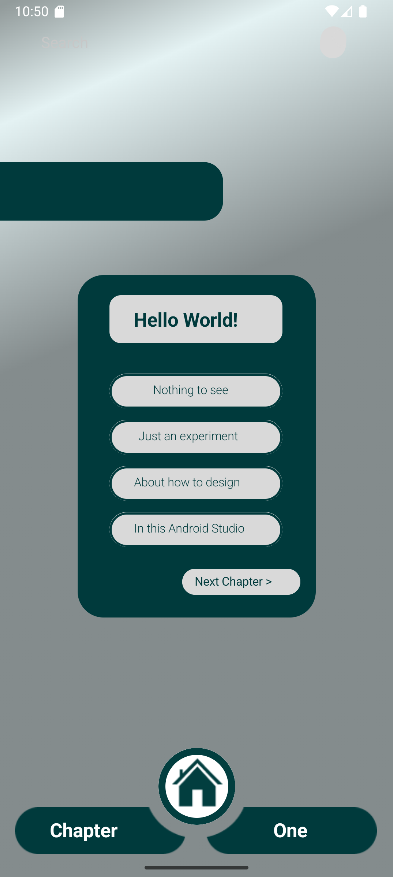

# 📱 MobileDevPartOne – Android Assignment #1

Welcome to my first mobile development assignment!  
This project is built using **Jetpack Compose** in **Android Studio**, and it showcases a simple yet structured UI layout inspired by a Figma design.

---

## 🎯 Project Description

This is a static UI screen coded entirely in **Jetpack Compose**, based on a mobile prototype created in **Figma**. It simulates a home screen layout with custom-styled buttons, text elements, and vector-based icons.

> The layout was directly adapted from design-to-code using a plugin export, then cleaned and debugged to run on an actual Android environment.

---

## 📁 Project Structure

- `MainActivity.kt` – Entry point of the app
- `AllLayout.kt` – The full Compose UI layout
- `ui.theme/` – Theme and color palette definitions
- `res/drawable/` – Custom icons and visual assets

---

## 🖼️ Preview

> You can find the design inspiration in `AllLayout.kt`  
> Designed to be viewed at `440dp x 956dp` in preview or emulator.

---

## 🚀 How to Run

1. Clone this repository  
2. Open in Android Studio  
3. Run on a device/emulator with API 21+  
4. Enjoy the custom layout UI!

---

## 📦 Assets Notice

Some icons used in this project are originally exported from Figma.  
Ensure you have the correct files in `res/drawable/` (`.svg` or `.xml`) and update the resource IDs accordingly.

---

## ✍️ Author

**Faiz Wibawa**  
[GitHub](https://github.com/faizwibawa) • Android Dev Bootcamp – Assignment 1 ✅

---

## 📌 Notes

> This assignment focuses on understanding layouts, modifiers, and UI element composition using Jetpack Compose.  
> No logic or navigation is implemented in this phase.

Stay tuned for future assignments with interactivity, navigation, and real backend features!
