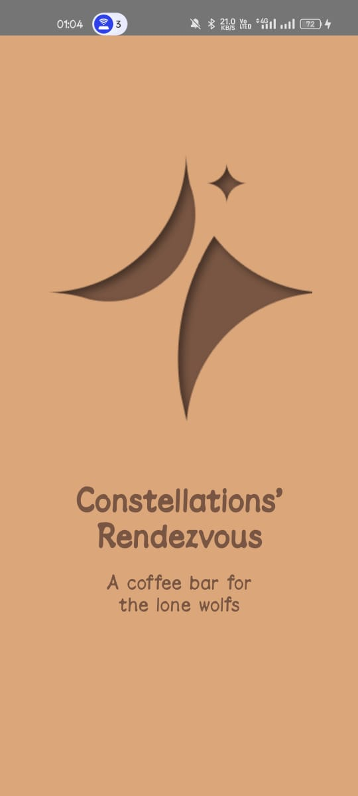
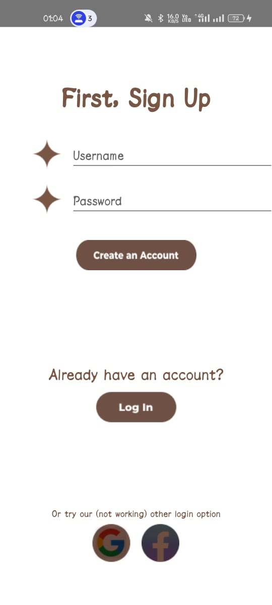
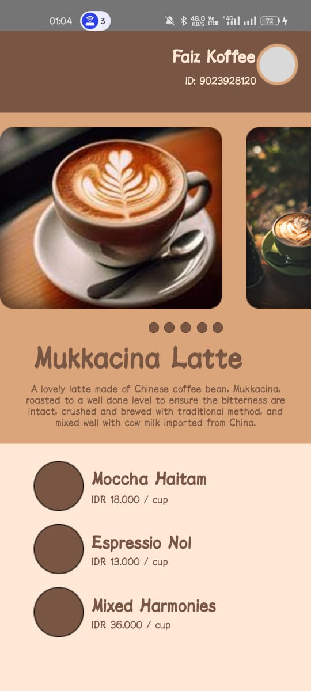

# 📱 Assignment 2: Coffee Bar App

A simple **To Do List** Android app created for a Mobile Development Bootcamp assignment. The app demonstrates the use of **Fragments**, **Intents**, and **XML Layouts** through an interactive user interface with multiple screens.

---

## ✨ Features

- 🟣 **Splash Screen** – Displays the app logo before launching into the main app.
- 🔐 **Login Screen** – Basic login form with navigation.
- 🏠 **Home Page** – Stylish scrollable layout with custom menu.
- ⚙️ Built using **Fragments** and **Navigation** between screens.

---

## 📸 Screenshots

### Splash Screen


### Login Screen


### Home Page


---

## 🚀 How to Run

1. Clone this repository:
   ```bash
   git clone https://github.com/YOUR_USERNAME/YOUR_REPO_NAME.git
